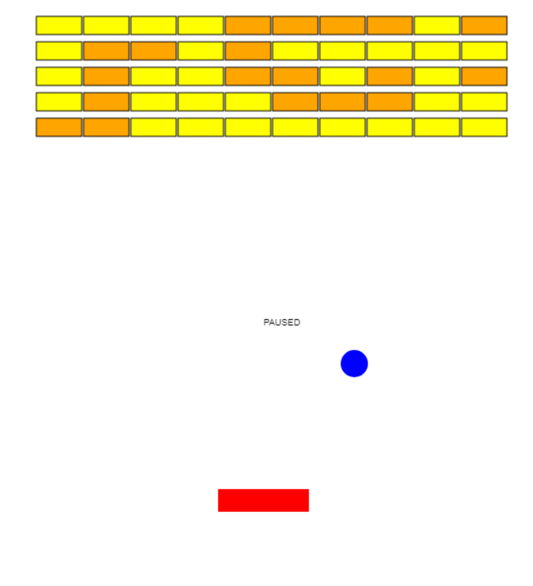
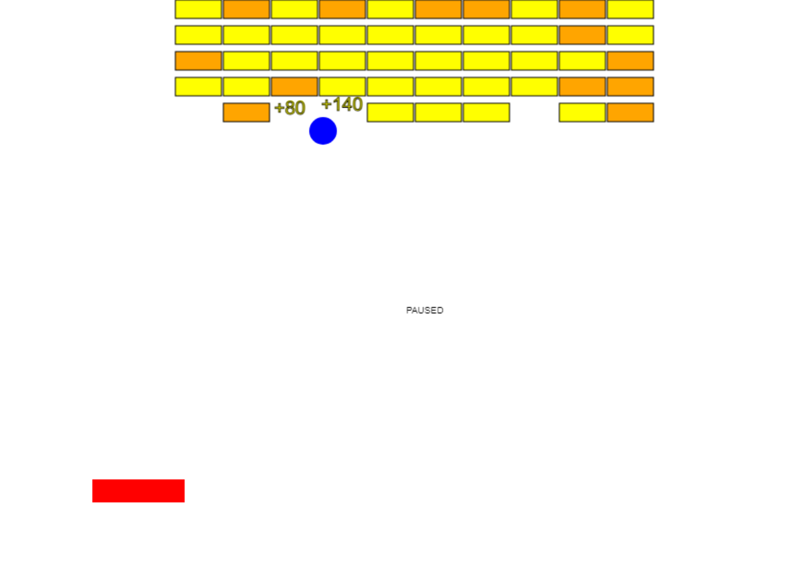

# Simple Breaker in 2hrs
I'm going over js animation. Here's a quick challenge I did. Spaghetti code but it works lol

## Screenshots

## Features
* Pausing: \<spacebar\>
* Move: \<arrowkeys\>/<a | d>
* Animated hit scores
